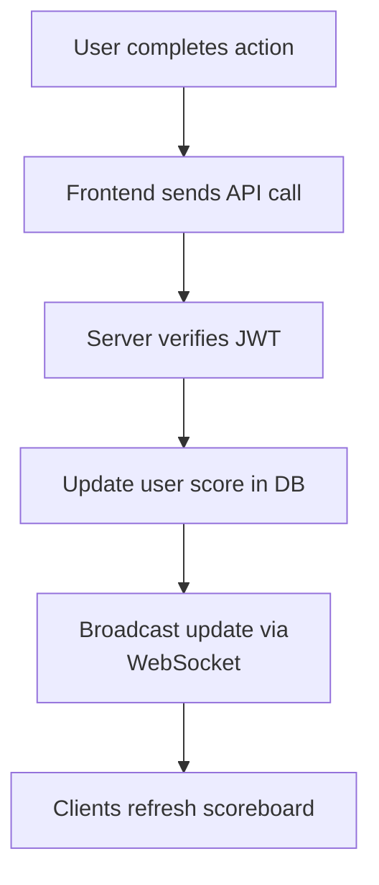

# Scoreboard Module

This module handles score updates and live leaderboard updates for a website scoreboard.

---

## Overview

- Shows the **top 10 users** with the highest scores.
- Updates happen **in real time** when users complete actions.
- Uses **authentication** to prevent fake or unauthorized score increases.

---

## API Endpoints

### `POST /api/scores/update`

Update a user's score after completing an action.

**Request Body:**

```json
{
  "userId": "uuid",
  "increment": 5
}
```

**Headers:**

```
Authorization: Bearer <JWT_TOKEN>
```

**Response:**

```json
{
  "message": "Score updated",
  "currentScore": 85
}
```

---

### `GET /api/scores/top`

Get the top 10 users.

**Response:**

```json
[
  { "username": "Alice", "score": 120 },
  { "username": "Bob", "score": 115 }
]
```

---

## Real-Time Updates

When a user's score is updated:

1. The API updates the database.
2. The server broadcasts the updated leaderboard to all clients.

**Example message:**

```json
{
  "type": "SCOREBOARD_UPDATE",
  "payload": [
    { "username": "Alice", "score": 120 },
    { "username": "Bob", "score": 115 }
  ]
}
```

---

## Flow Diagram



---

## Security

- Validate **JWT tokens** for each request.
- Check that increments are within allowed limits.
- Optionally add **rate limits** to avoid abuse.

---

## Improvements

- Add leaderboards by **day/week/month**.
- Use **Redis Pub/Sub** for scalable real-time updates.
- Cache top scores for better performance.
